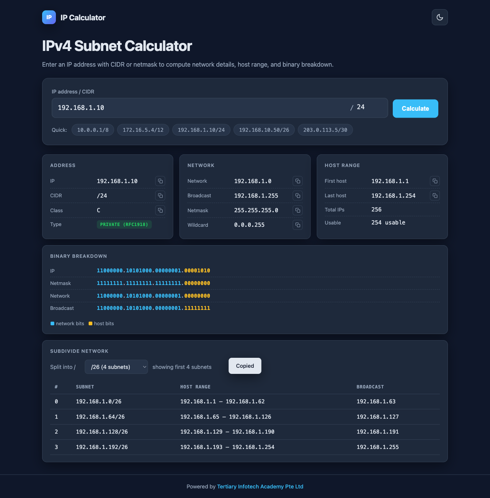

<div align="center">

# IP Calculator

[](https://developer.mozilla.org/en-US/docs/Web/HTML)
[](https://developer.mozilla.org/en-US/docs/Web/CSS)
[](https://developer.mozilla.org/en-US/docs/Web/JavaScript)
[](https://pages.github.com/)
[](https://opensource.org/licenses/MIT)

**A modern, fast, dependency-free IPv4 subnet calculator in your browser.**

[Live Demo](https://alfredang.github.io/ipcalculator/) · [Report Bug](https://github.com/alfredang/ipcalculator/issues) · [Request Feature](https://github.com/alfredang/ipcalculator/issues)

</div>

## Screenshot



## About

**IP Calculator** is a single-file, zero-dependency web app for IPv4 subnet calculations — inspired by [jodies.de/ipcalc](https://jodies.de/ipcalc) but built for a modern browser experience. Drop in any IP/CIDR (or dotted netmask) and instantly see the network breakdown, host range, binary visualization, and subdivided subnets.

### Key Features

| Feature | Description |
|---------|-------------|
| **Instant subnet math** | Network, broadcast, netmask, wildcard, host range, total/usable host count |
| **Binary visualization** | Color-coded network vs. host bits across IP, mask, network, broadcast |
| **Address classification** | Class A/B/C/D/E plus public / private (RFC1918) / loopback / APIPA / multicast badges |
| **Subnet splitting** | Subdivide a network into longer prefixes and view all child subnets |
| **Flexible input** | Accepts CIDR notation, dotted netmask, or pasted `1.2.3.4/24` |
| **Dark / light theme** | Toggle persists across sessions; defaults to dark |
| **Copy to clipboard** | One-click copy on every value |
| **Quick presets** | One-tap chips for common ranges (`/8`, `/12`, `/24`, `/26`, `/30`) |
| **Fully responsive** | Works on phone, tablet, and desktop |
| **Zero dependencies** | Pure HTML / CSS / JavaScript in a single file |

## Tech Stack

| Category   | Tech                                |
|------------|-------------------------------------|
| Markup     | HTML5                               |
| Styling    | CSS3 (custom properties, `color-mix`) |
| Logic      | Vanilla JavaScript (ES6+)           |
| Storage    | `localStorage` (theme preference)   |
| Hosting    | GitHub Pages (via GitHub Actions)   |

## Architecture

```
┌──────────────────────────────────────────────────┐
│                    Browser                        │
│  ┌────────────────────────────────────────────┐  │
│  │  index.html (single file)                  │  │
│  │   ├─ <style>  Theming & layout (CSS vars)  │  │
│  │   ├─ <body>   Form, results, footer        │  │
│  │   └─ <script> IP math & DOM rendering      │  │
│  └────────────────────────────────────────────┘  │
│                       │                           │
│              localStorage (theme)                 │
└──────────────────────────────────────────────────┘
                        │
                        ▼
            GitHub Pages (static hosting)
                        ▲
                        │
              GitHub Actions (deploy)
```

## Project Structure

```
ipcalculator/
├── index.html           # The entire app — markup, styles, and logic
├── screenshot.png       # README preview
├── README.md            # You are here
└── .github/
    └── workflows/
        └── deploy.yml   # GitHub Pages deploy workflow
```

## Getting Started

### Prerequisites

A modern web browser. That's it.

### Run Locally

Clone and open the file directly:

```bash
git clone https://github.com/alfredang/ipcalculator.git
cd ipcalculator
open index.html       # macOS
# or: xdg-open index.html  (Linux)
# or: start index.html      (Windows)
```

Or serve it with any static server:

```bash
python3 -m http.server 8000
# then visit http://localhost:8000
```

## Deployment

### GitHub Pages (configured)

This repo includes a GitHub Actions workflow at `.github/workflows/deploy.yml` that publishes the site automatically on every push to `main`. Once enabled, the live site is available at:

```
https://alfredang.github.io/ipcalculator/
```

### Any static host

Because the entire app is a single HTML file, it can be deployed to any static host — Netlify, Vercel, Cloudflare Pages, S3, or even a USB stick.

## Usage

1. Enter an IPv4 address (e.g. `192.168.1.10`).
2. Enter a CIDR prefix (`24`) or a dotted netmask (`255.255.255.0`).
3. Click **Calculate** — or paste `192.168.1.10/24` directly into the IP field.
4. Use the **Subdivide network** dropdown to break the network into smaller subnets.
5. Click any copy icon to copy that value to your clipboard.
6. Toggle the theme via the icon in the top-right.

## Contributing

Contributions, issues, and feature requests are welcome.

1. Fork the repo
2. Create your feature branch (`git checkout -b feature/amazing-thing`)
3. Commit your changes (`git commit -m 'Add amazing thing'`)
4. Push to the branch (`git push origin feature/amazing-thing`)
5. Open a Pull Request

## License

Distributed under the MIT License.

## Developed By

**Tertiary Infotech Academy Pte. Ltd.** — [tertiarycourses.com.sg](https://www.tertiarycourses.com.sg/)

## Acknowledgements

- Inspired by [jodies.de/ipcalc](https://jodies.de/ipcalc), a long-standing classic of network engineering tooling.
- Badges by [shields.io](https://shields.io).

---

<div align="center">

If this project helped you, please consider giving it a ⭐ — it really helps!

</div>
